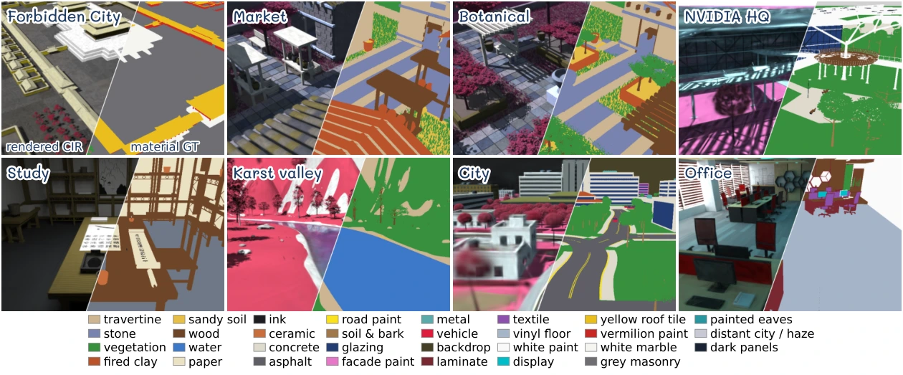

# Spectral World Renderer

### Towards Verifiable 3D Hyperspectral Unmixing

**Chia-Ming Lee · Yu-Jou Hsiao · Ming-Ching Chang · Xin Li · Yu-Lun Liu · Chih-Chung Hsu**

University at Albany, SUNY · National Yang Ming Chiao Tung University · National Cheng Kung University

[**Project page**](https://ming053l.github.io/Spectral-World-Renderer/) · [Supplement](docs/assets/supplementary.pdf) · [Demo video](docs/assets/videos/teaser.mp4)



Spectral World Renderer couples verifiable hyperspectral simulation with efficient 3D material decomposition. Reference images and a text brief guide executable world authoring; measured spectra and shared rendering samples produce aligned spectral observations, material labels and subpixel material proportions.

**SWR-Bench** contains eight indoor and outdoor worlds. **Abundance-GS** embeds a shared endmember dictionary and local mixture field in a compact Gaussian representation, enabling spectral rendering and spatial material queries. Appearance-guided initialization and a persistent assignment prior help retain initially distinct allocations.

Joint evaluation distinguishes spectral reconstruction quality from material identification and agreement with physical composition.

## Rendered worlds

| Scene | Combined demo | RGB | HSI false colour | Materials |
| --- | --- | --- | --- | --- |
| Forbidden City | [Watch](docs/assets/videos/forbidden_city_demo.mp4) | [RGB](docs/assets/videos/forbidden_city_rgb.mp4) | [HSI](docs/assets/videos/forbidden_city_hsi.mp4) | [Materials](docs/assets/videos/forbidden_city_material.mp4) |
| NVIDIA HQ | [Watch](docs/assets/videos/nvidia_demo.mp4) | [RGB](docs/assets/videos/nvidia_rgb.mp4) | [HSI](docs/assets/videos/nvidia_hsi.mp4) | [Materials](docs/assets/videos/nvidia_material.mp4) |
| Karst valley | [Watch](docs/assets/videos/karst_demo.mp4) | [RGB](docs/assets/videos/karst_rgb.mp4) | [HSI](docs/assets/videos/karst_hsi.mp4) | [Materials](docs/assets/videos/karst_material.mp4) |
| City | [Watch](docs/assets/videos/city_demo.mp4) | [RGB](docs/assets/videos/city_rgb.mp4) | [HSI](docs/assets/videos/city_hsi.mp4) | [Materials](docs/assets/videos/city_material.mp4) |
| Market | [Watch](docs/assets/videos/market_demo.mp4) | [RGB](docs/assets/videos/market_rgb.mp4) | [HSI](docs/assets/videos/market_hsi.mp4) | [Materials](docs/assets/videos/market_material.mp4) |
| Botanical | [Watch](docs/assets/videos/botanical_demo.mp4) | [RGB](docs/assets/videos/botanical_rgb.mp4) | [HSI](docs/assets/videos/botanical_hsi.mp4) | [Materials](docs/assets/videos/botanical_material.mp4) |
| Song study | [Watch](docs/assets/videos/study_demo.mp4) | [RGB](docs/assets/videos/study_rgb.mp4) | [HSI](docs/assets/videos/study_hsi.mp4) | [Materials](docs/assets/videos/study_material.mp4) |
| Office | [Watch](docs/assets/videos/office_demo.mp4) | [RGB](docs/assets/videos/office_rgb.mp4) | [HSI](docs/assets/videos/office_hsi.mp4) | [Materials](docs/assets/videos/office_material.mp4) |

Each combined demo shows RGB, HSI false colour, material identification and a synchronized comparison. Frames are rendered from the existing Abundance-GS models along continuous camera paths; they are not generated by diffusion or optical-flow interpolation. RGB is a visible-band composite near 630/550/460 nm; HSI uses a near-infrared composite near 800/650/550 nm. Videos use fixed display exposure within each scene and frozen training-view class mappings.

## Release status

This repository currently hosts the **project page, supplementary material and rendered demos**. Research code and full datasets are not included in this website release.

## Website

The project page is a dependency-free static site under `docs/`. To preview locally:

```bash
python -m http.server 8000 --directory docs
```

GitHub Pages deployment is handled by `.github/workflows/pages.yml`. In repository **Settings → Pages**, choose **GitHub Actions** as the source. Subsequent changes to `docs/` publish automatically.

## Citation

```bibtex
@misc{lee2026spectralworldrenderer,
  title = {Spectral World Renderer: Towards Verifiable 3D Hyperspectral Unmixing},
  author = {Chia-Ming Lee and Yu-Jou Hsiao and Ming-Ching Chang and Xin Li
            and Yu-Lun Liu and Chih-Chung Hsu},
  year = {2026}
}
```

## Acknowledgements

Project-page and demo presentation inspired by [LongSplat](https://linjohnss.github.io/longsplat/). All displayed scenes, renders and experimental results are from Spectral World Renderer.
